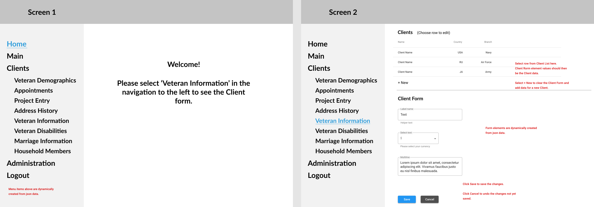

# readme.md for coding exercise

##	Introduction

Your assignment is to build a React front-end application to showcase your capabilities with front-end development relevant to our current project.

  - Create a React application to implement requirements.
  - Push to git repository of your choosing.
  - Send me the link to clone repository for review.

##  User task flow

The following is the expected User interaction through the application.

  - Open to Screen 1 as shown in the Wireframes.png.
  - User chooses "Veteran Information" in left navigation.
  - Client List and Form is displayed as shown in main content area.
  - User can choose a row from Client List and Client data values are displayed in Client Form for for editing.
  - User can edit form values and click Save to save changes or Cancel to discard changes.
  - User can choose "+New" and empty Client Form is displayed for data entry.
  - User can enter data and click Save to save changes or Cancel to discard changes.

  


##	Functional Requirements

  - Left navigation is to be created dynamically from json data provided.
  - The Client List is displayed after the "Veteran Information" navigation item is selected.
  - Client Form elements are to be dynamically created when a Client List row is selected or "+New" is clicked.
  - CRUD operations	- limited to Create Read and Update (Delete not required here).
    - Save data to json data file.


##	Technical Requirements

  - Use [React](https://reactjs.org/) library.
  
  - Use [json server](https://github.com/typicode/json-server) as the API for CRUD operations.
  
  - Use [material-ui](https://material-ui.com) as the UI library.

  - Project should be able to be cloned from your git repo, and then run with:  
    ```
    npm install
    npm start
    ```


##	Evaluation Criteria

The assignment will be evaluated on the implementation of the following:  
  - Component architecture and hierarchy
  - Handling state and state changes
  - Routing
  - Fetching data
  - Approach to building dynamic navigation and form


